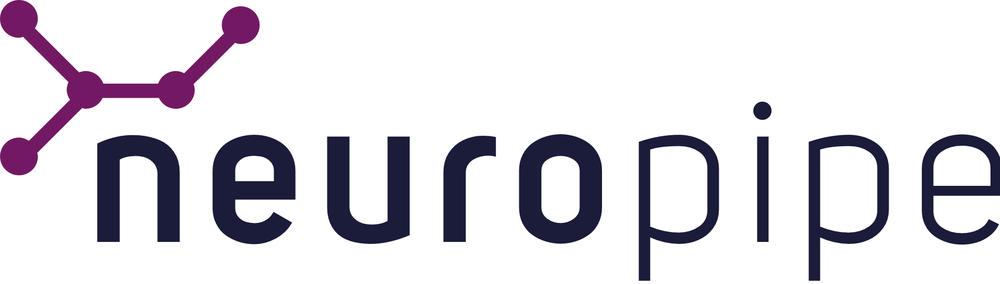

<h1 align="center">
  
  <br />
</h1>

`neuropipe` is an easy-to-use microframework for machine learning pipelines in Scikit-Learn. Simply answer a series of questions about your project in the command-line, and a custom template will be created, fit with preprocessing functions and models that are most likely to be relevant to your task.

The questions are based on the Scikit-Learn cheatsheet for selecting the right learning algorithm:

<br />


<!--**Notable projects using `neuropipe`:**

- [BitVision (17 stars)](http://github.com/shobrook/BitVision) – Bitcoin trading interface in the command-line that uses machine learning to predict price movements-->

## Usage

Install `neuropipe` with pip:

```
$ pip3 install neuropipe
```

Then go through the questionnaire and create your custom project folder by running:

```
$ neuropipe my_project
```

This will generate a pipeline...

## Workflow

A new project has the following file structure:

```bash
├── pipeline.py
├── engine/
│   ├── data_bus.py
│   ├── preprocessing.py
│   ├── model.py
│   └── analytics.py
├── data/
│   ├── raw.csv
│   └── processed.csv
├── models/
└── figures/
```

designed to be modular, blah blah blah
(Not finished yet, do not read)

Where:

- `pipeline.py`: defines the entire pipeline, from fetching to ....

- `pipeline.py`: defines the entire pipeline, from fetching raw data to model evaluation
- `engine/`: holds all of the modules used in your pipeline
  - `engine/data_bus.py`: defines the functions for fetching and loading raw data into the pipeline
- Easily generate random datasets, convert CSVs or dictionaries into dataframes, load toy datasets, or wrap your own functions for loading data
- Automatic caching for pre and post-processed datasets, so data doesn't have to be re-fetched (or re-scraped) on each run
- `engine/preprocessing.py`:
- `engine/model.py`: defines objects for learning models selected by neuropipe
-
- `engine/analytics.py`:
- `data/`: cache of your pre and post-processed data
- `models/`: holds serialized...
- `figures/`: holds visualizations (i.e. correlation heatmaps, confusion matrices, histograms, etc.)

## Contributing

All of the pipeline templates are based on my own personal projects, and are therefore very limited. If you've built an easily generalizable pipeline that isn't featured here, or have an idea for one, I strongly encourage you to add it to the template library. Read the contributing guidelines to learn how.

**Pending features:**

- Functionality for visualizing features, the training process, and results
- Common data wrangling operations, such as breaking a list into n-sized sublists
- Option to deploy the pipeline as a Flask app <!--incl. Dockerfile and retrain/predict endpoints-->
